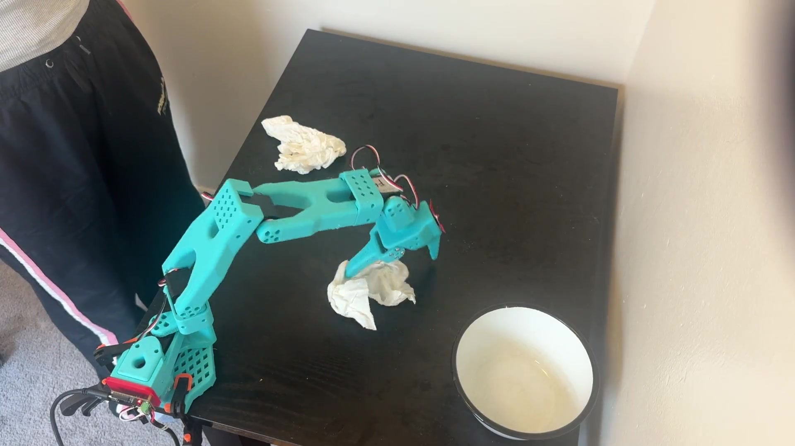

# deskbot

I built an so101 leader and follower arm to do simple pick and place tasks. I wanted to expand the project into something more usable and interesting. I'm curious about human robot interaction and building robots that work with humans, so I decided to build this desk bot to work on my desk with me and do tasks such as cleaning it up. 

# Demo

**Basic behavior** — Robot resets and picks up and disposes of trash 

<video src="media/basic.mp4" controls width="720"></video>

[basic.mp4](media/basic.mp4)

**Multiple pieces of trash** — Robot handles closes piece of trah 

<video src="media/multiple_trash.mp4" controls width="720"></video>

[multiple_trash.mp4](media/multiple_trash.mp4)

**Stop** — Robot stops when a hand is too close, and also from voice commands

<video src="media/stop.mp4" controls width="720"></video>

[stop.mp4](media/stop.mp4)

# Project Set Up 
- So101 arm attatched to table 
- Top camera input  
- Lerobot library 
- Paper towel "trash"  
- Bowl for "trashcan" 
- Voice commands: "pick up trash", "stop", "reset" 

# Install 
brew install portaudio 
pip install -r requirements.txt

# Note on AI usage
- I used cursor to assist with implementation recommendations, errors, and debugging
- all other code written by hand to learn and practice unless marked by a comment  

# Notable Features
Main control loop: voice → action planner → PID align to closest piece of trash -> ACT pick-place → safety filter action → send action 
- Voice input for robot control 
- Saftey supervisior so the robot slows when human is present and stops if a person's hands are too close 
- Detection and trained policy so the robot can handle multiple pieces of trash 
- Computer vision for detection of trash, human hand, and robot and calcuation of distance 
- PID control for movement of robot head
- Individual test scripts for debugging and feature calibration and testing  
- Planner that decides robot actions 
- ACT policy trained from scratch that controls trash picking up and disposal 

# File Structure 
- scripts 
    - testing bash scripts 
- src 
    - detection 
        - objdetect.py 
    - voice 
        - command.py 
    - main.py 
    - safetysupervisor.py 
    - skills.py
    - runpolicy.py (AI generated) - runs trained policy 
    - planner.py 
- tests (AI asistanced in creating these scripts)
    - movementtest.py - test joint control, controlled safe movment, and find optimal resting position 
    - testrunpolicy.py - tests running trained ACT policy with python code 
    - policysafetytest.py - used to test values between hand and robot head and then can also start policy, test the slowed down policy, uses the safteysupervisor  
    - voiceinputtest.py - tests commands using speech_recognition, tests queue, test microphone and also parse strings to validate
    - detectiontest.py - used to try different ways to detect objects, markers, camera input - tested yolo, aruco, color detection, pixel distance 
    - skillspidtest.py - pid movement test 
- media 
    - demo videos 
- armconfig
- configs 
- datasets
- models 
- notebooks 
    - google collab notebook
- requirements.txt 

# Dataset 
https://huggingface.co/datasets/Gracexu28/so101_desk_trash_merged 
- 60 episodes 
    - 40 episodes of single trash with slight variations in starting postion 
    - 20 episodes of multiple pieces of trash while targeting the closest piece of trash 

# Trained Model 
https://huggingface.co/Gracexu28/act_desk_trash
- ACT policy 
- 70% sucess rate 
- put in project locally to run it 

# Design Choices 
- Harness built to decide robot state and move robot to correct position, closest piece of trash, before running the ACT policy 
- Listening thread with command queue to be constantly listening for voice commands while not interrupting policies, camera detection, or main logic 
- Reset position allowed for robot to move towards trash just by rotating one motor which made motion control simpler and allowed for distance measurments using just the one top camera 
- All robot observation calls and actions sent to robot in main, other files help with logic, detection, action selection, but the action is always run through the safetysupervisor and sent to the robot in main
- Safety supervisor filters actions before being sent to the robot 

# Resource Links 
- so101 arm documentation: https://wiki.seeedstudio.com/lerobot_so100m/ 
- https://github.com/huggingface/lerobot 
- visualize dataset: https://huggingface.co/spaces/lerobot/visualize_dataset?path=%2FGracexu28%2Fso101_desk_trash_merged%2Fepisode_0
- so101 servo kit: https://www.amazon.com/dp/B0FH8CPXP7?lv=shuf&channelId=500&plpRedirect=mhFallback&th=1 

# Future Improvements 
- A way to verify a sucessful completed task to cleanly stop policy instead of using a set amount of time  
- Explicit state machine to make planner and main loop logic more clear 
- Improved, clean and consistent, data collection for improved policy preformance in all possible trash positions
- Finetune custom YOLO classifier to handle more trash types 
- Instead of just stopping, move around the human if it is in the way 
- More precise motion planning using methods such as inverse kinematics 
- Do more tasks such as picking up objects and handing them to the person 
- Autonomous movement that decides to pick up trask when it appears, constantly aware of the situation and the person at the desk 

# Things I Tried (and what I did to fix it)
- YOLO for trash detection: pretrained models don't have a useful "trash" / "paper towel" class, so detections were unreliable on the desk. Switched to white color + size filtering for paper towel trash.
- ArUco markers on the robot head: markers were too small in the top-down camera view and often failed to detect. Switched to a red marker + color detection for the robot head.
- Raising camera resolution / lowering YOLO confidence: helped a bit, but still not stable enough for the control loop, so color detection stayed.
- PID on horizontal pixel error (left/right in the image): the arm pans around the shoulder axis, so horizontal error didn't map cleanly to motor commands and the head often overshot or turned the wrong way. Switched to angular error around a calibrated shoulder pivot in the image.
- Running the ACT policy straight from Hugging Face: downloads / path / version mismatches made inference flaky. Kept a local copy under `models/act_desk_trash`.
- Aggressive joint targets from the policy or reset moves: LeRobot clamps relative motion (`max_relative_target`) and joint ranges, which looked like the robot "refusing" to move. Had to tune step size / relative limits instead of fighting the clamp.
- Relying only on the ACT policy to find trash: from arbitrary start poses it was inconsistent. Added the PID "go to trash" harness so the policy starts closer to a known approach.
- Picking up and handing a pen: the data recording kept failing so I ommited this due to time limitations but is a future expansion I hope to add
